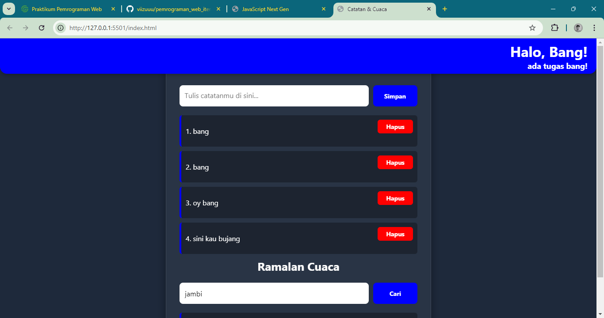
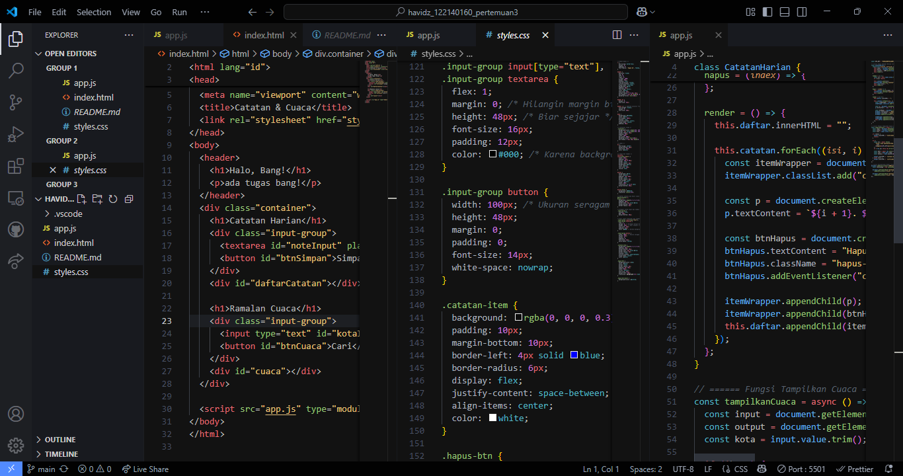

# 📓 Catatan Harian Orang Jambi

Aplikasi berbasis JavaScript modern untuk mencatat hal-hal penting dan memantau kondisi cuaca terkini berdasarkan kota yang kamu inputkan.

## ✨ Fitur

- ✅ Menambah dan menghapus catatan harian
- ✅ Menampilkan kondisi cuaca dan suhu berdasarkan nama kota
- ✅ Tampilan user-friendly dan responsif
- ✅ Menggunakan fitur JavaScript modern (ES6+)

## 💡 Teknologi yang Digunakan

- HTML5 + CSS3
- JavaScript (ES6+)
- [OpenWeatherMap API](https://openweathermap.org/api)

## 🖼️ Tampilan Aplikasi

### 💻 Tampilan di Browser


### 🧠 Kode Program di VS Code


## 🚀 Cara Menjalankan

1. Clone repositori ini:
   ```bash
   git clone https://github.com/viizuuu/pemrograman_web_itera_122140160
